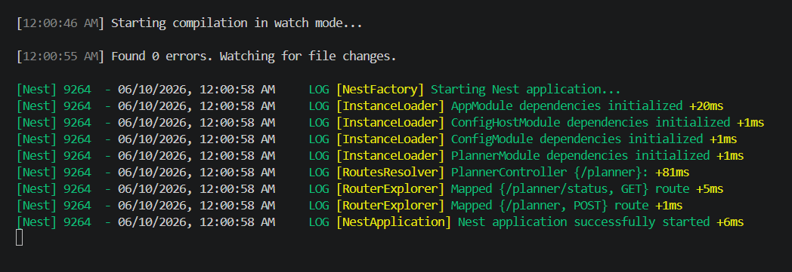
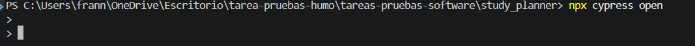
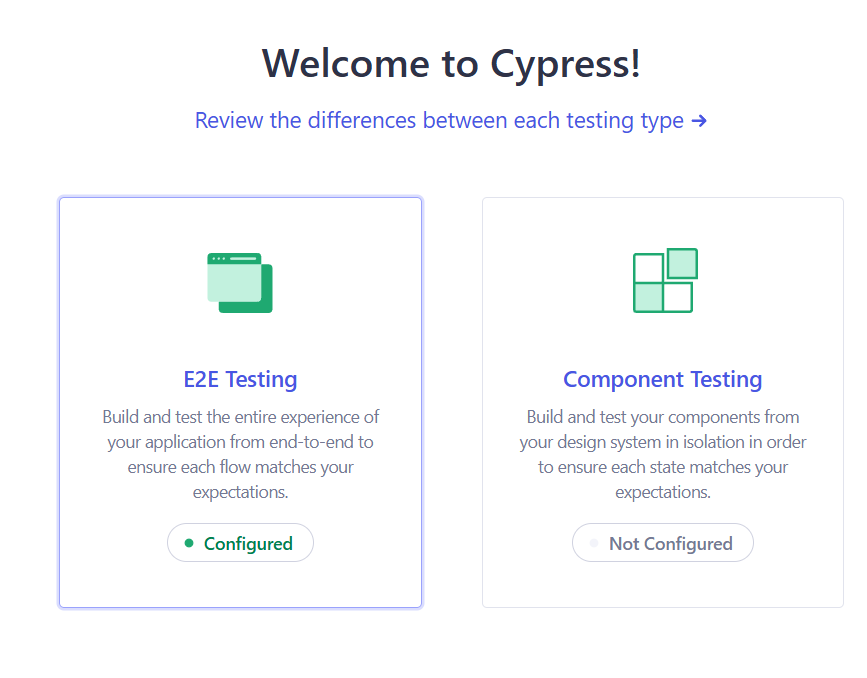
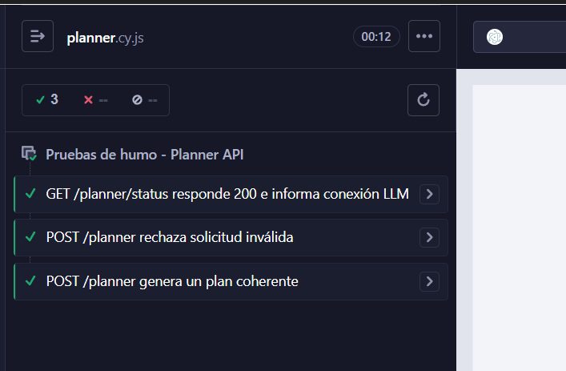

Integrantes: 
- Francisca Neira
- Ian Cicarelli

Instalación y como ejecutar


```bash
git clone https://github.com/FranUFRO/tareas-pruebas-software.git 
cd .\tareas-pruebas-software\study_planner\ 
npm install
```

Crear archivo .env en raiz del proyecto y poner:
```bash
PORT=3000
OPENROUTER_API_KEY= "api key propia"
OPENROUTER_MODEL= "ruta modelo"
```

Ejecutar proyecto y pruebas de humo:

primera terminal
```bash
cd .\tareas-pruebas-software\study_planner\ 
npm run start:dev
```
Imagen:



segunda terminal
```bash
cd .\tareas-pruebas-software\study_planner\ 
npx cypress open
```
Imagen:



Abre cypress visual y selecciona E2E 


Se ejecutan las pruebas



